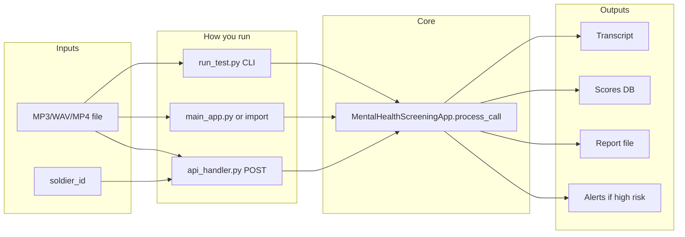

# How to Run This Repo

## Prerequisites (one-time)

- **Python 3.8+** (3.11 recommended; use the `.venv` in the repo root if present).
- **ffmpeg** installed (`brew install ffmpeg` on macOS).
- **Virtual environment**: use the existing `.venv` in the repo root.
- **Dependencies**: `pip install -r requirements.txt` (with venv activated).
- **First run**: MedASR and MedGemma models download from HuggingFace (~8–9GB total); allow 10–30 minutes and a stable internet connection.

Ensure you are actually using the venv when you run `python`. If your shell aliases `python`, use:

`.venv/bin/python ...` instead of `python ...`.

---

## Option 1: Command-line test (recommended for a single recording)

**Use case:** Process one audio file and see transcript, scores, risk, and report path.

1. Put your recording in the repo folder (or anywhere) and note the path.
2. From the repo root, with venv activated:

```bash
cd /path/to/MEDGEMMA
source .venv/bin/activate
python run_test.py path/to/your_recording.mp3
```

If `python` is aliased, run:

```bash
.venv/bin/python run_test.py path/to/your_recording.mp3
```

- **Entry point:** [run_test.py](run_test.py) (checks venv, then calls [main_app.py](main_app.py) `MentalHealthScreeningApp().process_call()`).
- **Output:** Printed results plus a report under `reports/` and rows in `data/screening_database.db`.

---

## Option 2: Python script or programmatic use

**Use case:** Run from `main_app` with a fixed file, or embed in your own script.

**A) Run the built-in example (looks for `example_call.wav` in repo root):**

```bash
source .venv/bin/activate
# create or copy a file named example_call.wav in repo root, then:
python main_app.py
```

**B) Use the app in your own script:**

```python
from main_app import MentalHealthScreeningApp
from datetime import datetime

app = MentalHealthScreeningApp()
result = app.process_call(
    call_path="path/to/recording.mp3",
    soldier_id="SOLDIER_001",
    call_timestamp=datetime.now()
)
# result has: call_id, scores, risk_assessment, report_path, transcript, etc.
```

Run that script with the venv Python (e.g. `python your_script.py` after `source .venv/bin/activate`, or `.venv/bin/python your_script.py`).

---

## Option 3: REST API

**Use case:** Upload audio via HTTP (e.g. from another app or frontend).

1. Start the server from repo root (venv activated):

```bash
source .venv/bin/activate
python api_handler.py
```

2. Server listens on `http://0.0.0.0:5000`. Endpoints:
   - `GET /health` — health check
   - `POST /process_call` — form fields: `file` (audio/video), `soldier_id`; optional: `call_timestamp` (ISO)
   - `GET /soldier_history/<soldier_id>` — screening history
   - `GET /alerts` — pending alerts

3. Example with curl:

```bash
curl -X POST -F "file=@/path/to/recording.mp3" -F "soldier_id=SOLDIER_001" http://localhost:5000/process_call
```

---

## Optional: Jupyter notebook

[pipeline_demo.ipynb](pipeline_demo.ipynb) runs the same pipeline (audio → extract → analyze → classifiers → report). To avoid `ModuleNotFoundError` (e.g. `soundfile`):

- Select the **kernel that uses your `.venv`** (e.g. "Python 3.11 (.venv)" or add the venv as a Jupyter kernel).
- Set `CALL_PATH` in the notebook to your audio file path (e.g. `your_recording.mp3`).
- Run from the **repo root** so imports like `audio_processor` and `main_app` resolve.

---

## Where to put the MP3

- **Easiest:** Put the file in the repo root and run:
  `python run_test.py your_file.mp3`
- **Any path:** Use an absolute or relative path:
  `python run_test.py /path/to/your_file.mp3`

---

## Flow summary



---

## Quick reference

| Goal | Command / action |
|------|------------------|
| One-off test with your recording | `source .venv/bin/activate` then `python run_test.py <path_to_mp3>` |
| Check environment | `python test_minimal.py` |
| Use in code | Import `MentalHealthScreeningApp` from `main_app`, call `process_call(...)` |
| Serve HTTP API | `python api_handler.py`, then POST to `http://localhost:5000/process_call` |
| Train classifiers (optional) | `python train_classifiers.py --data train.csv --train_all` (see [README](README.md) / [train_classifiers.py](train_classifiers.py)) |
